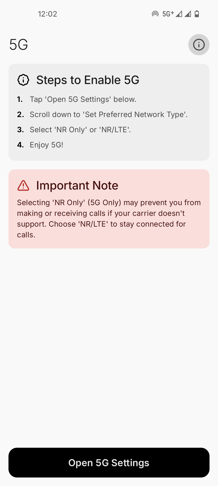
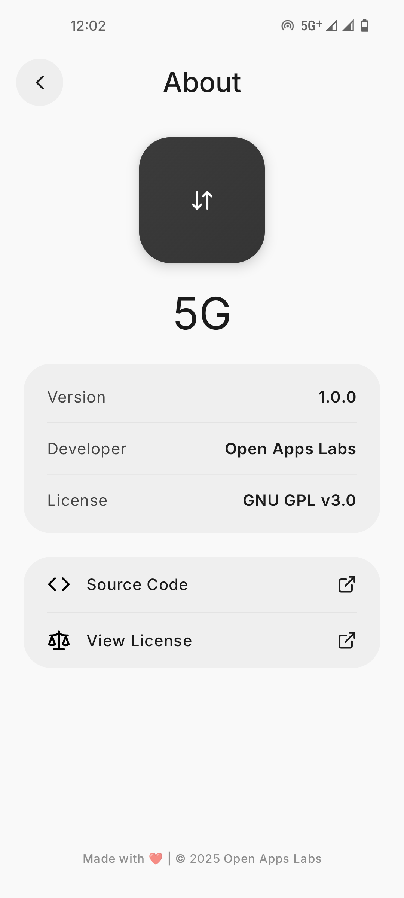
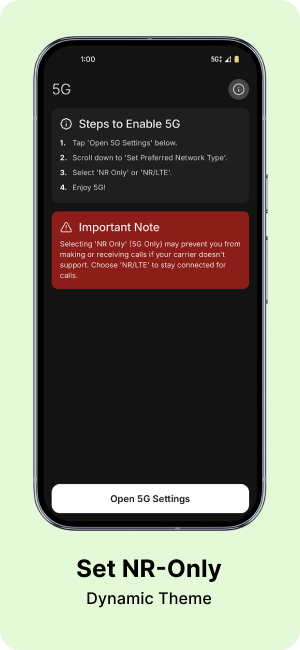
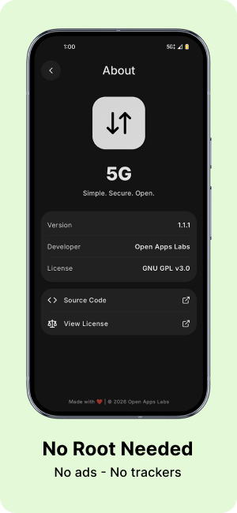

<h1 align="center">5G</h1>

5G is a modern, open-source Android network monitoring app built with Jetpack Compose and Material Design 3. It offers fast, simple, and privacy-focused access to real-time 5G/NR signal info and key network settings.

> **From my point of view, this app is complete in terms of features, and there’s nothing left to add.**  
> Going forward, I will focus only on adding OEM-specific enhancements and addressing device-specific issues.  
> That said, you’re still welcome to **raise issues or request features** if you think of any.
> **Disclaimer:** Hidden radio information (##4636##) may not be accessible on carrier-locked devices, custom ROMs, or OEM-restricted firmware (e.g., Samsung Knox, MIUI). This app cannot enable 5G on unsupported hardware.

---

## 📥 Download

Get the latest version of **5G**:

  

  <strong>Google Play (Closed Testing)</strong> To install via Play Store:
   
  <a href="https://play.google.com/apps/testing/com.openappslabs.fiveg"><strong>Join the tester program (Web)</strong></a> &nbsp;&nbsp;
  <a href="https://play.google.com/store/apps/details?id=com.openappslabs.fiveg"><strong>Open in Play Store (Android)</strong></a>

  
  
 
  
  

---

## 📱 Screenshots

  
  

  
  

---

## ✨ Features

- **Material You Design:** Fully compatible with Material 3 dynamic theming, Supports adaptive icon.
- **Real-time Network Status:** Monitor LTE/5G(NR) connection state and signal info.
- **Quick System Access:** Direct shortcuts to network/telephony settings.
- **Lightweight:** Instant startup.
- **No Ads/Trackers:** 100% privacy-focused.

---

## 🐛 Bug Reporting

> Some devices may encounter an issue where nothing happens when you click "Open 5G Settings." This can be caused by differences in location or the settings name for accessing hidden radio information.
> If you experience this issue, please report it for your specific device or operating system.

If you encounter any bugs, issues, or unexpected behavior while using 5G, please feel free to [open an issue](https://github.com/OpenAppsLabs/5G/issues) on this repository.

When reporting a bug, please include:

- Steps to reproduce the issue
- Expected behavior
- Actual behavior
- Device/Android version
- Screenshots (if applicable)

This helps me fix problems faster and improve the app for everyone. I welcome all constructive feedback and suggestions.

If you find 5G useful, please consider ⭐ starring the repository to help others discover it.

---

## 📄 License

5G is licensed under the [GNU GPL v3.0](https://www.gnu.org/licenses/gpl-3.0.en.html).
